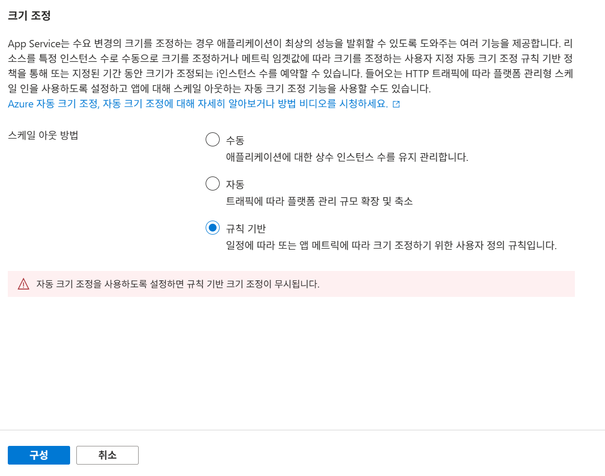
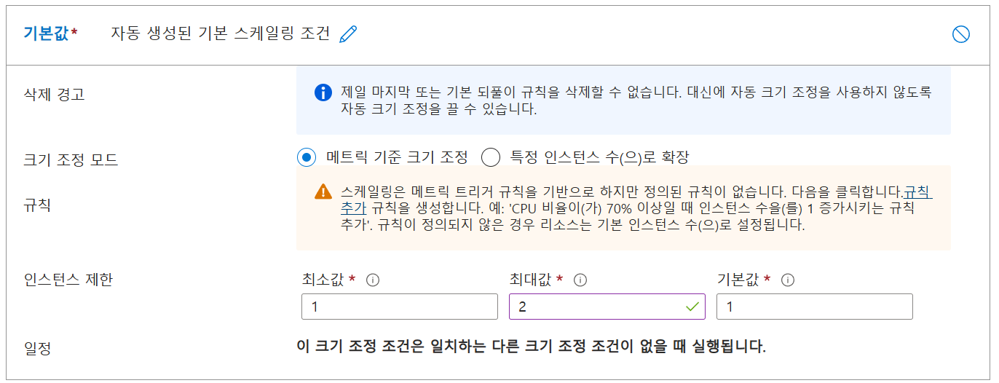
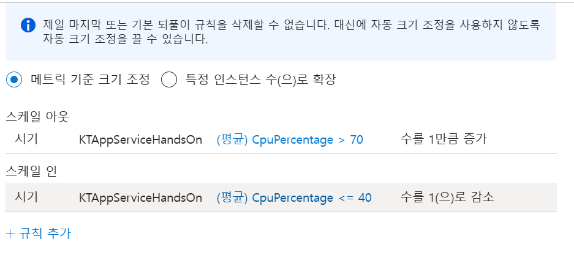

# Lab 02: Azure App Service 고급 배포 및 운영 실습

이 실습에서는 Azure App Service의 고급 기능을 통해 웹 애플리케이션을 배포하고 관리하는 방법을 다룹니다.
아래 네 가지 주요 실습 과제를 진행합니다:

- Exercise 1: 배포 슬롯을 이용한 웹앱 배포 및 스왑
- Exercise 2: 슬롯 별로 별도의 리소스 연결
- Exercise 3: 오토 스케일링

---

## Exercise 1: 배포 슬롯을 이용한 웹앱 배포 및 스왑
- Azure App Service의 배포 슬롯 기능을 활용하여 스테이징 환경에 코드를 배포하고 검증합니다.  
- 스테이징 슬롯과 프로덕션 슬롯 간에 SWAP(전환)을 실행하여 코드 변경을 반영합니다.  

## Exercise 2: 슬롯 별로 별도의 리소스 연결
각 배포 슬롯이 개별 리소스(예: 스토리지 계정, API 엔드포인트)를 사용할 수 있도록 설정합니다.  

## Exercise 3: 오토 스케일링
웹앱의 부하에 따라 자동으로 인스턴스를 조정하는 오토 스케일링 기능을 설정합니다.  

---

각 단계는 Azure 포털, VS Code, 그리고 Azure CLI를 사용하여 진행되며, 이를 통해 웹앱의 안정성과 가용성을 극대화할 수 있습니다.


## Exercise 1: 배포 슬롯을 이용한 웹앱 배포 및 스왑

### Task 1: 스테이징 슬롯 생성
1. Azure 포털의 **리소스, 서비스 및 문서 검색**에서 imgweb[이름]을 검색해 선택합니다.
1. **배포 슬롯** 메뉴를 선택합니다.
2. **+ 추가** 버튼을 클릭하여 새 슬롯을 만듭니다.
3. Clone settings from: imgweb[이름]을  설정합니다.
4. 슬롯 이름에 `staging` 입력 후 **추가**를 클릭합니다.
5. 생성된 `staging` 슬롯을 선택합니다.


### Task 2: Web/Index.cshtml 파일의 이미지 헤더 업데이트

1. VS Code로 Lab2/Start/Web 폴더를 엽니다.  
2. Web/Index.cshtml 파일(또는 Pages/Index.cshtml 위치)에 접근하여 파일 내 "./images"라는 텍스트를 "./images - Update Version 1"로 변경 후 저장합니다.  
3. 터미널에서 프로젝트를 빌드 및 게시합니다:
    ```pwsh
    dotnet publish -c Release -o publish
    ```
4. 게시된 파일이 포함된 publish 폴더를 web.zip으로 압축합니다:
    ```pwsh
    Compress-Archive -Path publish\* -DestinationPath web.zip -Force
    ```
5. 압축된 web.zip 파일을 Azure CLI를 사용하여 배포합니다:
    ```pwsh
    az webapp deployment source config-zip --resource-group KT-AppServiceHandsOn --name <앱이름> --slot staging --src web.zip
    ```
5. mgweb[이름] 웹 url과 imgweb[이름]-staging 모두 확인해보고 서로 다른 것을 확인합니다.

### Task 3: 스왑 및 롤백 
1. Azure 포털에서 imgweb[이름] 페이지에서 **배포 슬롯** 메뉴로 이동합니다.
2. 상단의 **Swap** 버튼을 클릭합니다.
3. **Source Slot**에 `staging`을, **Target Slot**에 `production`을 선택한 후 Swap을 진행합니다.
4. imgweb[이름] 웹 url과 imgweb[이름]-staging 모두 확인해보고 서로 바뀌었는 지를 확인합니다.
5. **Source Slot**에 `staging`을, **Target Slot**에 `production`을 선택한 후 Swap을 진행합니다.
6. 롤백 완료 후, 프로덕션 슬롯의 콘텐츠와 환경 변수가 이전 상태로 정상 복원되었는지 검증합니다.

## Exercise 2: 슬롯 별로 별도의 리소스 연결

### Task 1: 스토리지를 서로 공유하는 지 확인

1. 두 웹 앱 중 아무 사이트에서 Contoso Photo Gallery 웹페이지의 “새 이미지 업로드” 섹션에서 다음 작업을 수행합니다:
    a. **Browse** 버튼을 선택합니다.  
    b. 파일 탐색기에서 Allfiles (랩경로루트)\Labs02\Starter\./images 폴더로 이동하여 **burger.jpg** 파일을 선택하고 **열기**를 클릭합니다.  
    c. **Upload** 버튼을 선택합니다.
2. 갤러리 이미지 목록이 새 이미지로 업데이트되었는지 확인합니다. (필요에 따라 브라우저를 새로 고침할 수 있습니다.)
3. 다른 스테이지의 사이트에서도 똑같이 업데이트 되었는 지 확인합니다.

### Task 2: 스토리지 계정 생성

1. Azure 포털 상단의 **리소스, 서비스, 문서 검색** 텍스트 상자에 "Storage Accounts"를 입력하고, 결과 목록에서 **스토리지 계정**를 선택합니다.
2. **스토리지 계정** 블레이드에서 **+ 만들기** 버튼을 클릭합니다.
3. **스토리지 계정 만들기** 블레이드의 **기본** 탭에서 다음 작업을 수행한 후 **검토 + 만들기**를 선택합니다:

    - **구독**: 드롭다운 목록에서 기본값 유지
    - **리소스 그룹**: **KT-AppServiceHandsOn**를 선택
    - **스토리지 계정 이름**: `imgstor[본인이름]staging` 입력
    - **지역**: 드롭다운 목록에서 `(Asia Pacific) Korea Central` 선택
    - **기본 서비스**: 변경 없음
    - **성능**: Standard 옵션 선택
    - **중복 저장**: 드롭다운 목록에서 **로컬 중복 저장 (LRS)** 선택
4. 설정을 확인한 후 **검토 + 만들기**를 클릭합니다.
5. **만들기**를 클릭합니다.
6. 완료 후 **리소스 이동** 클릭하여 리소스 그룹 블레이드로 이동
7. 스토리지 계정 블레이드 내 **Security + networking** 섹션에서 **Access keys**를 선택합니다.
1. **Access keys** 블레이드에서 임의의 **Connection string**을 선택한 후 **Show** 버튼을 클릭하여 값을 확인합니다.
1. 표시된 연결 문자열 값을 복사하여 기록합니다.
1. 메모장을 열고 복사한 연결 문자열을 붙여넣습니다. 이 값은 이후 실습에 사용됩니다.

### Task 3: 샘플 Blob 업로드

1. 스토리지 계정 블레이드 내 "데이터 저장소" 섹션에서 "컨테이너" 링크를 선택합니다.
2. 컨테이너 블레이드에서 "+ 컨테이너"를 선택합니다.
3. 새 컨테이너 창에서:
    - "이름" 텍스트 상자에 "./images"를 입력합니다.
    - "만들기"를 선택합니다.
4. 생성된 "./images" 컨테이너로 이동합니다.
5. "./images" 블레이드에서 "업로드"를 선택합니다.
6. Blob 업로드 창에서:
    - 파일 섹션에서 "파일 찾아보기"를 선택하거나 드래그 앤 드롭 기능을 사용합니다.
    - 파일 탐색기 창에서 (랩경로루트)\Labs02\Starter\./images로 이동하여 "sub.jpg" 파일을 선택한 후 "열기"를 선택합니다.
    - "파일이 이미 존재하는 경우 덮어쓰기" 체크 박스가 선택되어 있는지 확인합니다.
7. "업로드"를 선택하고 Blob 업로드가 완료될 때까지 기다립니다.

### Task 4: 스테이징 슬롯 생성
1. Azure 포털의 **리소스, 서비스 및 문서 검색**에서 imgapi[이름]을 검색해 선택합니다.
1. **배포 슬롯** 메뉴를 선택합니다.
2. **+ 추가** 버튼을 클릭하여 새 슬롯을 만듭니다.
3. Clone settings from: imgapi[이름]을  설정합니다.
4. 슬롯 이름에 `staging` 입력 후 **추가**를 클릭합니다.
5. 생성된 `staging` 슬롯을 선택합니다.

### Task 5: 웹 앱을 Staging에 배포

1. VS Code로 Lab2/Start/API 폴더를 엽니다.
3. 터미널에서 프로젝트를 빌드 및 게시합니다:
    ```pwsh
    dotnet publish -c Release -o publish
    ```
4. 게시된 파일이 포함된 publish 폴더를 api.zip으로 압축합니다:
    ```pwsh
    Compress-Archive -Path publish\* -DestinationPath api.zip -Force
5. 압축된 api.zip 파일을 Azure CLI를 사용하여 배포합니다:
    ```pwsh
    az webapp deployment source config-zip --resource-group KT-AppServiceHandsOn --name <앱이름> --slot staging --src api.zip
    ```

### Task 6: 스테이징 웹앱 구성

1. imgapi[이름]에서 배포 슬롯 staging을 열고 App Service 블레이드의 Settings 섹션에서 **환경 변수** 링크를 선택합니다.
2. **앱 설정** 탭에서 **StorageConnectionString** 를 클릭합니다.
3. 팝업 창에서 다음 정보를 입력합니다:  
    - **이름**: StorageConnectionString  
    - **값**: 이전에 복사한 스토리지 연결 문자열을 붙여넣습니다.  
    - **배포 슬롯 설정**: 체크 해야 함.
4. 팝업 창을 닫고 앱 설정 섹션으로 돌아가려면 **적용**을 클릭합니다.
5. 앱 설정 섹션 하단에서 **적용**을 선택합니다.  
    ※ 앱 설정을 업데이트할 때 앱이 재시작된다는 경고가 나타나면 **확인**을 클릭하고 설정이 저장될 때까지 기다립니다.
6. App Service URL을 확인하려면 **개요** 링크로 이동하여 **기본 도메인** 아래의 값을 복사한 다음 메모장에 붙여넣습니다.  
    - 복사한 도메인 앞에 **https://**를 추가합니다.  
    - 이 URL은 이후 실습 단계에서 사용됩니다.

### Task 7: Web Staging의 AppUrl에 스테이징 URL 적용

1. imgweb[이름] 웹 앱을 `리소스, 서비스 및 문서검색`에서 찾습니다.
2. `배포` - `배포슬롯`을 이동해 `staging`을 클릭합니다.
3. `앱 설정`에서 `ApiUrl`을 선택합니다.
4. 방금 복사한 `imgimg[본인이름]staging`의 `Url`을 붙여 넣습니다.
5. `배포 슬롯 설정`을 클릭합니다.
6. `적용`을 클릭 합니다.
7. 앱 설정도 다시 `적용`을 클릭 합니다.
8. imgweb[이름]과 imgweb[이름]-staging을 열어봅니다. 나오는 이미지가 다른 지 확인합니다.

### Review

이번 실습에서는 스테이지를 생성하고 스테이지 별로 별도의 리소스를 연결하였습니다.

---

## Exercise 3: 오토 스케일링

### Task 1: Azure Portal에서 App Service Plan 확인
1. Azure Portal에 로그인합니다.
2. 좌측 메뉴에서 **App Services**를 선택하고, **imgweb[이름]** 웹앱을 찾습니다.
3. **개요** 탭에서 현재 사용 중인 App Service Plan 정보를 확인합니다.

### Task 2: App Service Plan 확장
1. **imgweb[이름]** 웹앱의 **스케일업 (App Service 요금제)** 옵션을 클릭합니다.
2. 프리미엄 V3(Premium V3) 옵션을 찾습니다.
3. **Premium v3 P0V3** 계획을 선택한 후, **선택**을 클릭합니다.
4. 적용 변경 사항이 완료될 때까지 기다립니다.

### Task 3: 규칙 기반 스케일 아웃 설정

1. App Service Plan 블레이드에서 **스케일 아웃 (App Service 요금제)** 옵션을 클릭합니다.
2. **규칙 기반** 을 선택합니다.
3. **구성**을 클릭합니다.
    
4. **구성**에서 **사용자 지정 자동 크기 조정**을 클릭합니다.
5. **기본 값**에서 **크기 조정 모드**를 **메트릭 기준 크기 조정**을 선택합니다.
6. 아래 이미지에 보이는 것과 비슷한 **규칙 추가**를 클릭합니다.
    

### Task 4: 특정 조건에서 인스턴스가 늘어나는 규칙 추가

1. 규칙 추가 창에서 다음 항목을 설정합니다:
    - **메트릭**: CPU 사용률 또는 선택한 다른 메트릭
    - **조건**: 평균 값이 80% 이상
    - **기간**: 5분 동안 조건 충족 시
2. **행동** 설정에서:
    - 인스턴스 수 증가: +1
    - **휴지 기간**: 10분 (확인 후 인스턴스 증감 적용을 위한 시간)
3. 설정을 추가 합니다.

### Task 4: 특정 조건에서 인스턴스가 다시 줄어드는

1. 다시 **규칙 추가**를 클릭합니다.
1. 규칙 추가 창에서 다음 항목을 설정합니다:
    - **메트릭**: CPU 사용률 또는 선택한 다른 메트릭
    - **조건**: 평균 값이 40% 보다 작읍
    - **기간**: 5분 동안 조건 충족 시
2. **행동** 설정에서:
    - 인스턴스 수 증가: +1
    - **휴지 기간**: 10분 (확인 후 인스턴스 증감 적용을 위한 시간)
3. 설정을 추가 합니다.
4. 아래와 같이 설정되었는 지 확인합니다.

    

5. **저장**을 클릭합니다.

### Review

이 단계에서는 포털에서 규칙 기반 스케일 아웃을 구성하고, 조건 충족 시 인스턴스가 자동으로 증가하도록 설정하는 방법을 다루었습니다.