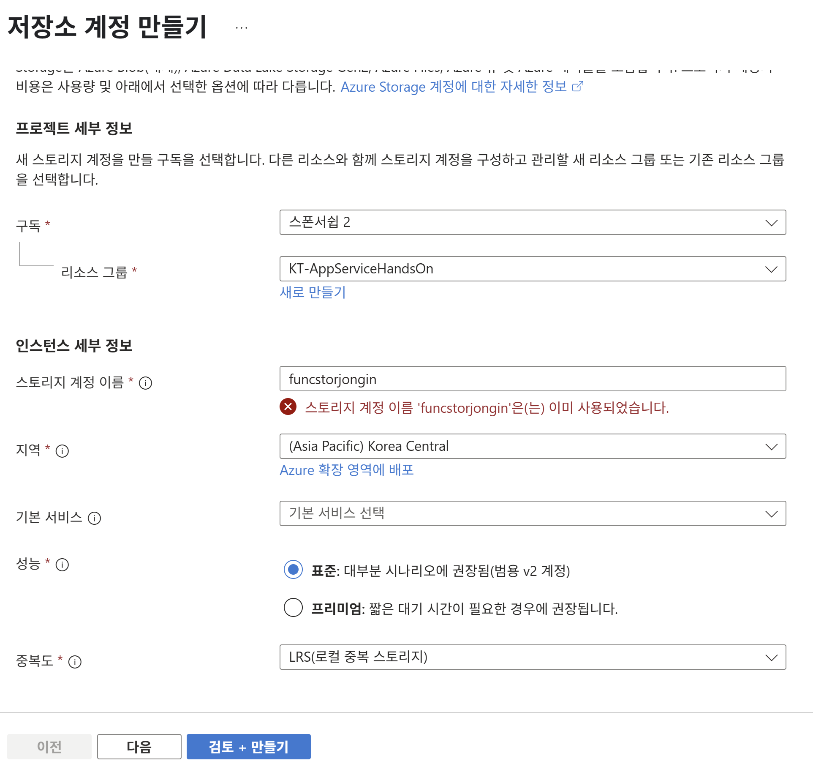
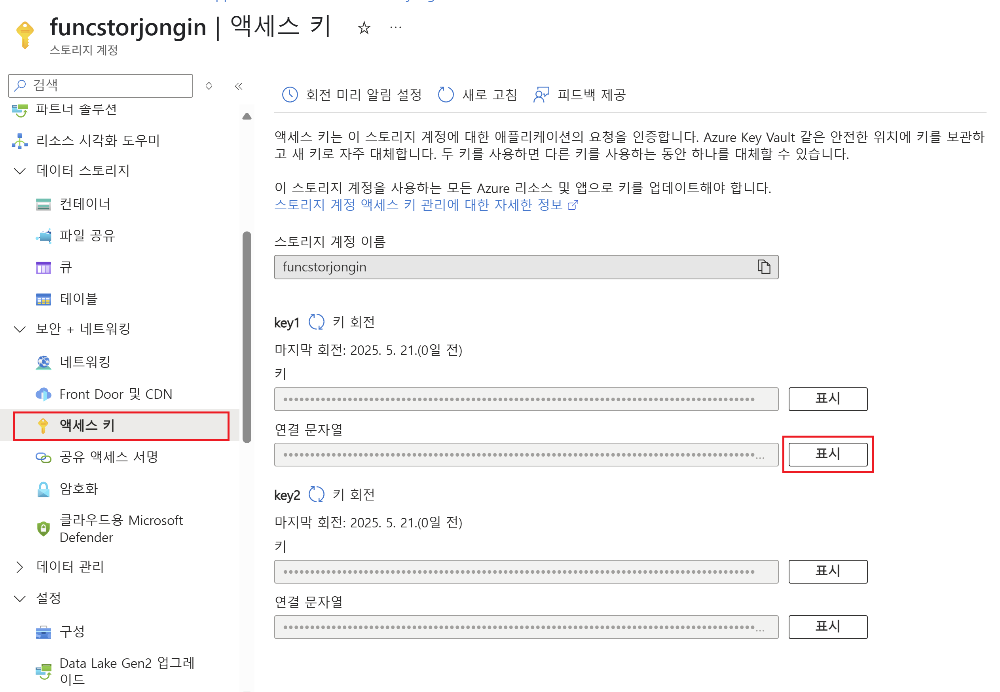
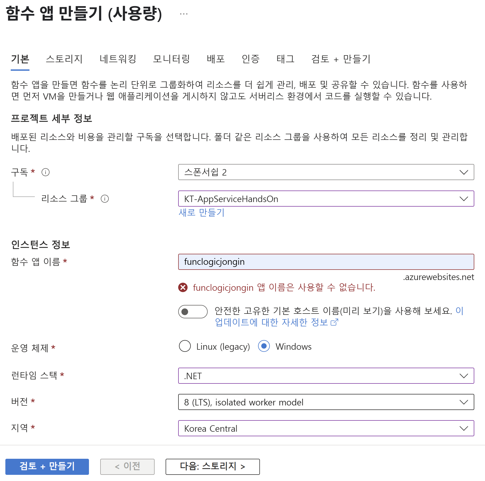

# Lab 03: Azure Functions를 사용한 작업 처리 로직 구현

이 실습에서는 Azure Functions를 이용하여 작업 처리 로직을 구현하는 방법을 다룹니다. HTTP POST 요청을 통해 입력된 텍스트를 그대로 반향(echo)하는 함수, 스케줄에 따라 실행되어 로그에 메시지를 기록하는 함수, 그리고 Azure Storage 계정과 연동하여 파일의 내용을 반환하는 함수를 개발합니다.

## 실습 목표
- HTTP POST 요청을 처리하는 Azure Function 구현
- 타이머(스케줄) 기반 Azure Function으로 로그 기록
- Azure Storage 계정과 연동하여 파일 내용 읽기

## 실습 시나리오
실습의 주요 단계는 다음과 같습니다:

### Exercise 1: Azure 리소스 생성
- Azure 포털에서 리소스 그룹, 스토리지 계정, 함수 앱을 생성합니다.

### Exercise 2: 로컬 Azure Functions 프로젝트 구성
- Azure Functions Core Tools로 로컬 프로젝트 초기화 및 설정을 구성합니다.

### Exercise 3: HTTP 요청으로 트리거되는 함수 생성
- HTTP 트리거 함수를 작성하고 로컬에서 테스트하여 요청 본문을 반향(echo)합니다.

### Exercise 4: 스케줄 트리거 Azure Function 구현
- Timer 트리거 함수를 작성하여 1분 간격으로 로그를 기록하도록 구현합니다.

### Exercise 5: 다른 서비스와 통합하는 함수 구현
- Blob Storage의 JSON 파일을 읽어 HTTP 응답으로 반환하는 함수를 작성합니다.

### Exercise 6: 로컬 함수 프로젝트를 Azure Functions 앱에 배포
- Azure CLI 및 Core Tools를 사용해 로컬 함수를 Azure에 배포하고 포털에서 검증합니다.

## 아키텍처 다이어그램

※ 실제 다이어그램은 Azure Functions와 Storage 계정, 그리고 사용자 간의 상호작용을 나타냅니다.

---

실습 진행 중 Microsoft Azure 포털 및 관련 툴의 UI가 변경될 수 있으므로, 필요 시 최신 UI에 맞추어 단계별로 진행하시기 바랍니다.

Review  
- HTTP 요청을 처리하는 Azure Function 구현 및 테스트  
- 타이머 트리거를 통해 정해진 스케줄에 따라 함수 실행 및 로그 기록 확인  
- Azure Storage와의 연동을 통한 파일 내용 반환 기능 검증


## Exercise 1: Azure 리소스 생성

### 작업 1: Azure 포털 접속
작업 표시줄에서 Microsoft Edge 아이콘을 선택합니다.  
브라우저 창에서 https://portal.azure.com 에 접속한 후, 이 랩에서 사용할 계정으로 로그인합니다.

### 작업 2: Azure 스토리지 계정 생성
Azure 포털의 "리소스, 서비스, 문서 검색" 텍스트 상자를 사용하여 "Storage Accounts"를 검색한 후, 결과 목록에서 해당 항목을 선택합니다.

1. Storage accounts 블레이드에서 **+ 만들기** 버튼을 선택합니다.
2. **Create a storage account** 블레이드의 **기본** 탭에서 다음과 같이 설정한 후 **검토**를 선택합니다:  
    - **구독**: 기본값 유지  
    - **리소스 그룹**: “KT-AppServiceHandsOn” 선택
    - **Storage account name**: funcstor[yourname] 입력  
    - **지역**: (Asia Pacific) Korea Central 선택  
    - **Primary service**: 변경 없음  
    - **성능**: Standard 선택  
    - **중복성**: Locally-redundant storage (LRS) 선택
    

   아래 스크린샷은 스토리지 계정 생성 시 설정 내용을 보여줍니다.

3. **검토** 탭에서 선택한 옵션들을 확인합니다.  
4. **만들기** 버튼을 눌러 지정한 설정으로 스토리지 계정을 생성합니다.

   참고: 생성 작업이 완료될 때까지 기다리십시오.

5. **개요** 블레이드에서 **리소스로 이동** 버튼을 선택하여 새로 생성된 스토리지 계정 블레이드로 이동합니다.
6. 스토리지 계정 블레이드의 **보안 + 네트워킹** 섹션에서 **Access keys**를 선택합니다.
7. **Access keys** 블레이드에서 **키 표시** 버튼을 선택합니다.

8. 표시된 연결 문자열 중 아무 값을 확인한 후 Notepad에 복사하여 기록합니다.  
   참고: 두 문자열은 상호 교환 가능합니다.

### 작업 3: Function App 생성
1. Azure 포털의 내비게이션 창에서 **리소스 만들기** 링크을 선택합니다.
2. **리소스 만들기** 블레이드의 "리소스, 서비스, 문서 검색" 텍스트 상자에 **함수**를 입력한 후 Enter 키를 누릅니다.
3. Marketplace 검색 결과 블레이드에서 **함수 앱** 항목을 선택합니다.
4. **함수 앱** 블레이드에서 **만들기** 버튼을 선택합니다.
5. **함수 앱 만들기** 블레이드에서 사용량 호스팅 계획이 선택되었는지 확인한 후 **선택** 버튼을 클릭합니다.
6. **함수 앱 만들기 (Consumption)** 블레이드의 **기본** 탭에서 다음과 같이 설정한 후 **다음: 스토리지** 버튼을 선택합니다:  
    - **구독**: 기본값 유지  
    - **리소스 그룹**: “KT-AppServiceHandsOn” 선택  
    - **함수 앱 이름**: funclogic[yourname] 입력  
    - **런타임 스택**: .NET 선택  
    - **버전**: 8 (LTS), isolated worker model 선택  
    - **지역**: (Asia Pacific) Korea Central 선택  
    - **운영 체제**: Linux 선택
    
   아래 스크린샷은 함수 앱 생성 시 설정 내용을 보여줍니다.

7. **스토리지** 탭에서 다음 작업을 수행한 후 **검토 + 만들기** 버튼을 선택합니다:  
    - **스토리지 계정**: 드롭다운 목록에서 funcstor[yourname] 스토리지 계정을 선택
8. **검토 + 만들기** 탭에서 선택한 옵션들을 확인합니다.
9. **만들기** 버튼을 눌러 지정한 구성으로 함수 앱을 생성합니다.

   참고: 생성 작업이 완료될 때까지 기다리십시오.

### 검토
본 연습에서는 랩 진행에 필요한 모든 Azure 리소스를 생성했습니다.

## Exercise 2: 로컬 Azure Functions 프로젝트 구성

### 작업 1: 함수 프로젝트 초기화
1. 작업 표시줄에서 터미널 아이콘을 선택합니다.
2. 다음 명령어로 함수 프로젝트 빈 디렉터리로 이동합니다:
    ```pwsh
    cd (랩루트폴더)\Lab03\Starter\func
    ```
    > 참고: Windows 탐색기에서 `.gitignore` 파일의 읽기 전용 속성을 해제합니다.
3. Azure Functions Core Tools를 사용하여 dotnet-isolated 런타임으로 새 로컬 프로젝트를 초기화합니다:
    ```pwsh
    func init --worker-runtime dotnet-isolated --target-framework net8.0 --force
    ```
4. 터미널을 닫습니다.

### 작업 2: 연결 문자열 구성
1. 시작 화면에서 Visual Studio Code를 실행하고 **파일 → 폴더 열기**를 선택합니다.
2. `(랩루트폴더)\Lab03\Starter\func` 폴더를 선택하여 엽니다.
3. 탐색기 뷰에서 `local.settings.json` 파일을 엽니다.
4. `AzureWebJobsStorage` 설정 값을 확인하고:
    ```json
    "AzureWebJobsStorage": "UseDevelopmentStorage=true",
    ```
5. 해당 값을 이전에 기록한 스토리지 계정 연결 문자열로 변경합니다.
6. 파일을 저장합니다.

### 작업 3: 프로젝트 빌드 및 검증
1. 터미널 아이콘을 선택하여 터미널을 엽니다.
2. 프로젝트 폴더로 이동합니다:
    ```pwsh
    cd (랩루트폴더)\Lab03\Starter\func
    ```
3. 다음 명령어로 .NET 프로젝트를 빌드합니다:
    ```pwsh
    dotnet build
    ```

### 검토
이번 실습에서는 로컬 Azure Functions 프로젝트를 초기화하고, 스토리지 연결 문자열을 구성한 후 빌드하여 개발 환경을 준비했습니다.

## Exercise 3: HTTP 요청으로 트리거되는 함수 생성

### 작업 1: HTTP 트리거 함수 생성
1. 작업 표시줄에서 터미널 아이콘을 선택합니다.
2. 함수 프로젝트 디렉터리로 이동합니다:
   ```pwsh
   cd (랩루트폴더)\Lab03\Starter\func
   ```
3. Azure Functions Core Tools를 사용하여 HTTP 트리거 템플릿으로 새 함수 `Echo`를 생성합니다:
   ```pwsh
   func new --template "HTTP trigger" --name "Echo"
   ```
4. 터미널을 닫습니다.

### 작업 2: HTTP 트리거 함수 코드 작성
1. VS Code를 실행하고 **파일 → 폴더 열기**로 `(랩루트폴더)\Lab03\Starter\func` 폴더를 엽니다.
2. 탐색기에서 `Echo.cs` 파일을 선택하여 엽니다.
3. 기존 내용을 모두 삭제한 후, 다음 코드를 붙여넣습니다:
   ```csharp
   using System.Net;
   using Microsoft.Azure.Functions.Worker;
   using Microsoft.Azure.Functions.Worker.Http;
   using Microsoft.Extensions.Logging;
       
   namespace func
   {
       public class Echo
       {
           private readonly ILogger _logger;
   
           public Echo(ILoggerFactory loggerFactory)
           {
               _logger = loggerFactory.CreateLogger<Echo>();
           }
   
           [Function("Echo")]
           public async Task<HttpResponseData> Run([HttpTrigger(AuthorizationLevel.Function, "get", "post")] HttpRequestData req)
           {
                _logger.LogInformation("C# HTTP trigger function processed a request.");
   
                var response = req.CreateResponse(HttpStatusCode.OK);
                response.Headers.Add("Content-Type", "text/plain; charset=utf-8");
   
                using var reader = new StreamReader(req.Body);
                string requestBody = await reader.ReadToEndAsync();
                await response.WriteStringAsync(requestBody);
   
                return response;
           }
       }
   }
    ```
4. 파일을 저장합니다.

### 작업 3: 함수 로컬 실행 및 검사
1. 터미널을 열고 함수 디렉터리로 이동합니다:
   ```pwsh
   cd (랩루트폴더)\Lab03\Starter\func
   ```
2. 함수 앱을 실행합니다:
   ```pwsh
   func start --build
   ```
3. 명령 프롬프트를 열고 아래 명령으로 POST 요청을 테스트합니다:
   ```cmd
   curl -X POST -i http://localhost:7071/api/echo -d 3
   curl -X POST -i http://localhost:7071/api/echo -d 5
   curl -X POST -i http://localhost:7071/api/echo -d "Hello"
   curl -X POST -i http://localhost:7071/api/echo -d "{\"msg\": \"Successful\"}"
   ```
4. 터미널과 명령 프롬프트를 모두 닫습니다.

### 검토
이번 연습에서는 HTTP POST 요청을 수신하여 본문을 그대로 반환하는 `Echo` 함수를 생성, 로컬에서 실행하고 `curl`로 결과를 검증했습니다.

## Exercise 4: 스케줄 트리거 Azure Function 구현

### 작업 1: 스케줄(타이머) 트리거 함수 생성
1. 터미널을 열고 함수 프로젝트 디렉터리로 이동합니다:
   ```pwsh
   cd (랩루트폴더)\Lab03\Starter\func
   ```
2. Azure Functions Core Tools를 사용하여 Timer trigger 템플릿으로 새 함수 `Recurring`을 생성합니다:
   ```pwsh
   func new --template "Timer trigger" --name "Recurring"
   ```
3. 터미널을 닫습니다.

### 작업 2: 함수 코드 관찰 및 수정
1. VS Code에서 `(랩루트폴더)\Lab03\Starter\func` 폴더를 열고 `Recurring.cs` 파일을 엽니다.
2. 기본 생성된 코드를 확인합니다:
   ```csharp
   using System;
   using Microsoft.Azure.Functions.Worker;
   using Microsoft.Extensions.Logging;
   
   namespace func
   {
       public class Recurring
       {
           private readonly ILogger _logger;
   
           public Recurring(ILoggerFactory loggerFactory)
           {
               _logger = loggerFactory.CreateLogger<Recurring>();
           }
   
           [Function("Recurring")]
           public void Run([TimerTrigger("0 */5 * * * *")] TimerInfo myTimer)
           {
               _logger.LogInformation($"C# Timer trigger function executed at: {DateTime.Now}");
               if (myTimer.ScheduleStatus is not null)
               {
                   _logger.LogInformation($"Next timer schedule at: {myTimer.ScheduleStatus.Next}");
               }
           }
       }
   }
   ```
3. CRON 표현식을 `"0 */5 * * * *"`에서 `"0 */1 * * * *"`로 변경하여 1분 간격으로 실행되도록 수정합니다.
4. 파일을 저장합니다.

### 작업 3: 함수 로컬 실행 및 검증
1. 터미널을 열고 함수 디렉터리로 이동합니다:
   ```pwsh
   cd (랩루트폴더)\Lab03\Starter\func
   ```
2. 함수 앱을 실행합니다:
   ```pwsh
   func start --build
   ```
3. 1분마다 로그에 메시지가 출력되는지 확인한 후 터미널을 닫습니다.

### 검토
이번 연습에서는 스케줄 트리거를 이용해 정해진 간격으로 실행되는 Azure Function을 생성, 수정, 로컬에서 실행 및 검증했습니다.

## Exercise 5: 다른 서비스와 통합하는 함수 구현

### 작업 1: 샘플 콘텐츠를 Azure Blob Storage에 업로드
1. Azure 포털 탐색 창에서 **리소스 그룹**을 선택하고, 이전에 생성한 Serverless 리소스 그룹을 선택합니다.
2. 리소스 그룹에서 `funcstor[yourname]` 스토리지 계정을 선택합니다.
3. **데이터 저장소 > 컨테이너**를 선택합니다.
4. **+ 컨테이너**를 클릭하고 이름(Name) 텍스트 상자에 `content`를 입력한 후 **만들기**를 클릭합니다.
5. 생성된 `content` 컨테이너를 선택하고 **업로드**를 클릭합니다.
6. **업로드 블롭** 창에서 **파일 찾아보기**를 클릭하거나 드래그 앤 드롭으로 `Lab03\Starter\func` 폴더의 `settings.json` 파일을 선택하고, **덮어쓰기** 체크 후 **업로드**를 클릭합니다.

### 작업 2: HTTP 트리거 함수 생성
1. 터미널을 열고 함수 프로젝트 디렉터리로 이동합니다:
   ```pwsh
   cd (랩루트폴더)\Lab03\Starter\func
   ```
2. Azure Functions Core Tools를 사용하여 HTTP 트리거 템플릿으로 새 함수 `GetSettingInfo`를 생성합니다:
   ```pwsh
   func new --template "HTTP trigger" --name "GetSettingInfo"
   ```

### 작업 3: Azure Storage Blob 확장 패키지 등록
1. 터미널에서 함수 프로젝트 디렉터리로 이동합니다:
   ```pwsh
   cd (랩루트폴더)\Lab03\Starter\func
   ```
2. 다음 명령어를 실행하여 Blob 확장 패키지를 추가합니다:
   ```pwsh
   dotnet add package Microsoft.Azure.Functions.Worker.Extensions.Storage --version 6.2.0
   ```

### 작업 4: Blob 입력 바인딩을 이용한 함수 코드 작성
1. VS Code에서 `Lab03\Starter\func` 폴더를 열고 `GetSettingInfo.cs` 파일을 엽니다.
2. 자동 생성된 `Run` 메서드 시그니처부터 끝까지(약 17행 이후)를 다음 코드로 교체합니다:
   ```csharp
   [Function("GetSettingInfo")]
   public async Task<HttpResponseData> Run(
       [HttpTrigger(AuthorizationLevel.Function, "get", "post")] HttpRequestData req,
       [BlobInput("content/settings.json", Connection = "AzureWebJobsStorage")] string blobContent
   )
   {
       _logger.LogInformation("C# HTTP trigger function processed a request.");
       _logger.LogInformation($"{blobContent}")   
       var response = req.CreateResponse(HttpStatusCode.OK);
       response.Headers.Add("Content-Type", "text/plain; charset=utf-8");
       await response.WriteStringAsync(blobContent)   
       return response;
   }
   ```
3. 파일을 저장합니다.
4. Using을 바뀌줍니다.
   ```csharp
    using System.Net;
    using Microsoft.Azure.Functions.Worker;
    using Microsoft.Azure.Functions.Worker.Http;
    using Microsoft.Extensions.Logging;
   ```

### 작업 5: curl로 함수 테스트
1. 터미널에서 함수 앱을 실행합니다:
   ```pwsh
   func start --build
   ```
2. 새로운 터미널(또는 명령 프롬프트)에서 다음 명령으로 GET 요청을 실행합니다:
   ```cmd
   curl -X GET -i http://localhost:7071/api/GetSettingInfo
   ```
3. 반환된 JSON(예: 버전, 루트 경로, 디바이스 ID, 알림 정보)을 확인합니다.
   ```json
   {
      "version": "0.2.4",
      "root": "/usr/libexec/mews_principal/",
      "device": {
            "id": "21e46d2b2b926cba031a23c6919"
      },
      "notifications": {
            "email": "joseph.price@contoso.com",
            "phone": "(425) 555-0162 x4151"
      }
   }
   ```

### 검토
이 연습에서는 Blob Storage의 JSON 파일을 HTTP 함수로 가져와 응답으로 반환하도록 구현했습니다.

## Exercise 6: 로컬 함수 프로젝트를 Azure Functions 앱에 배포

### 작업 1: Azure Functions Core Tools를 사용한 배포
1. 터미널을 열고 함수 프로젝트 디렉터리로 이동합니다:
   ```pwsh
   cd (랩루트폴더)\Lab03\Starter\func
   ```
2. Azure CLI에 로그인합니다:
   ```pwsh
   az login
   ```
3. 브라우저 창에서 Microsoft 계정 또는 Azure AD 계정으로 로그인한 후 터미널로 돌아올 때까지 대기합니다.
4. 다음 명령어를 실행하여 함수 앱을 게시합니다(예: funclogic[yourname]을 실제 함수 앱 이름으로 대체):
   ```pwsh
   func azure functionapp publish <function-app-name> --dotnet-version 8.0
   ```
5. 배포가 완료될 때까지 기다립니다.

### 작업 2: 배포 검증
1. Azure 포털에서 **리소스 그룹** > KT-AppServiceHandsOn 리소스 그룹 > 해당 **함수 앱(funclogic[yourname])**을 선택합니다.
2. 왼쪽 메뉴에서 **함수**를 선택한 후 `GetSettingInfo` 함수를 클릭합니다.
3. **코드 + 테스트** 탭에서 **테스트/실행**을 선택합니다.
4. HTTP 메서드 목록에서 **GET**을 선택하고 **실행**을 클릭합니다.
5. 응답 JSON(버전, 루트, 디바이스 ID, 알림 정보 등)을 확인합니다.

### 검토
이번 연습에서는 로컬 Azure Functions 프로젝트를 Azure에 배포하고, Azure 포털에서 함수 실행을 검증했습니다.

