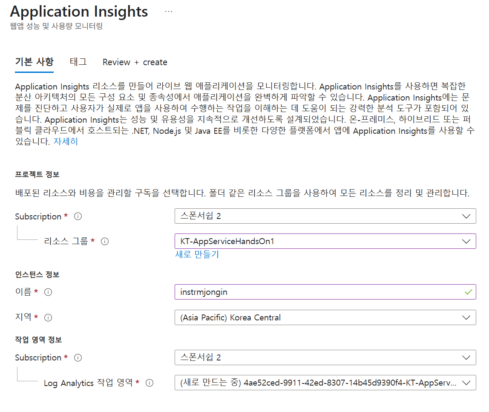
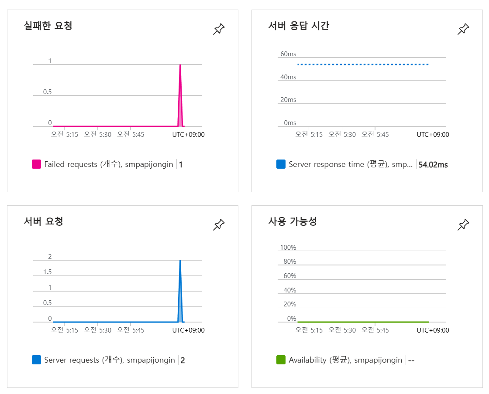

# Lab 06: Azure에 배포된 서비스 모니터링 실습

## 안내사항

## 실습 시나리오

이 실습에서는 Azure에서 Application Insights 리소스를 생성하고, Web API를 자동 스케일링 및 모니터링하도록 구성합니다. 수집된 로그와 메트릭 데이터를 통해 서비스 사용 현황을 확인할 수 있습니다.

## 아키텍처 다이어그램


### 연습 1: Azure 리소스 생성 및 구성

#### 작업 1: Application Insights 리소스 생성

1. Azure 포털에서 페이지 상단의 **리소스, 서비스 및 문서 검색** 텍스트 상자를 사용하여 **Application Insights**를 검색한 후, 결과 목록에서 **Application Insights**를 선택합니다.

1. **Application Insights** 블레이드에서 **+ 만들기**를 선택합니다.

1. **Application Insights** 블레이드의 **기본 사항** 탭에서 다음 작업을 수행한 후 **검토 + 만들기**를 선택합니다:
    
    | 설정 | 작업 |
    | -- | -- |
    | **구독** 드롭다운 목록 | 기본값 유지 |
    | **리소스 그룹** 섹션 | **새로 만들기** 선택, **KT-AppServiceHandsOn** 입력 후 **확인** 선택 |
    | **이름** 텍스트 상자 | **instrm**[이름] 입력 |
    | **지역** 드롭다운 목록 |Korea Central |
    | **작업 영역 세부정보** 섹션 | **구독** 및 **Log Analytics 작업 영역** 드롭다운 목록의 기본값 유지 |
    
    다음 스크린샷은 **Application Insights** 블레이드에서 구성된 설정을 보여줍니다.

    
     
1. **검토 + 만들기** 탭에서 이전 단계에서 선택한 옵션을 검토합니다.

1. **만들기**를 선택하여 지정한 구성으로 **Application Insights** 인스턴스를 생성합니다.

    > **참고**: 생성 작업이 완료될 때까지 기다린 후 이 실습을 진행합니다.

1. **Microsoft.AppInsights \| 개요** 블레이드에서 **리소스로 이동** 버튼을 선택하여 새로 생성된 **Application Insights** 리소스의 블레이드로 이동합니다.

1. **Application Insights** 블레이드의 **구성** 섹션에서 **속성** 링크를 선택합니다.

1. **속성** 블레이드에서 **계측 키** 항목 옆에 있는 **클립보드에 복사** 버튼을 선택한 후 복사한 값을 기록해 둡니다. 이 값은 나중에 이 실습에서 사용됩니다.

    > **참고**: 이 키는 클라이언트 애플리케이션이 특정 **Application Insights** 리소스에 연결하는 데 사용됩니다.

### 작업 3: Azure Web API 리소스 생성

1. Azure 포털에서 페이지 상단의 **리소스, 서비스 및 문서 검색** 텍스트 상자를 사용하여 **App Services**를 검색한 후, 결과 목록에서 **App Services**를 선택합니다.

1. **App Services** 블레이드에서 **+ 만들기**를 선택한 후 **+ 웹 앱**을 선택합니다.
    
1. **웹 앱 만들기** 블레이드의 **기본 사항** 탭에서 다음 작업을 수행한 후 **모니터링 + 보안** 탭을 선택합니다:

    | 설정 | 작업 |
    | -- | -- |
    | **구독** 드롭다운 목록 | 기본값 유지 |
    | **리소스 그룹** 드롭다운 목록 | **KT-AppServiceHandsOn** 선택 |
    | **이름** 텍스트 상자 | **smpapi**[이름] 입력 |
    | **게시** 섹션 | **코드** 선택 |
    | **런타임 스택** 드롭다운 목록 | **.NET 8 (LTS)** 선택 |
    | **운영 체제** 섹션 |  **Windows** 선택 |
    | **지역** 드롭다운 목록 |  **Application Insights** 리소스의 위치로 선택한 동일한 지역 선택 |
    | **Windows 요금제 (Korea Central)** 섹션 | **새로 만들기** 선택, **이름** 텍스트 상자에 **MonitoredPlan** 입력 후 **확인** 선택 |
    | **요금제** 섹션 |  기본값 유지 |

1. **모니터링 + 보안** 탭에서 다음 작업을 수행한 후 **검토 + 만들기**를 선택합니다:
    
    | 설정 | 작업 |
    | -- | -- |
    | **Application Insights 사용** 섹션 | **예**가 선택되어 있는지 확인 |
    | **Application Insights** 드롭다운 목록 | 이전에 이 실습에서 생성한 **instrm**[이름] Application Insights 리소스 선택 |
    
1. **웹 앱 만들기** 탭에서 이전 단계에서 선택한 옵션을 검토합니다.

1. **만들기**를 선택하여 지정한 구성으로 웹 API를 생성합니다.

    > **참고**: 생성 작업이 완료될 때까지 기다린 후 이 실습을 진행합니다.

1. 배포 **개요** 블레이드에서 **리소스로 이동** 버튼을 선택하여 새로 생성된 Azure 웹 API의 블레이드로 이동합니다.

1. **App Service** 블레이드의 **설정** 섹션에서 **환경 변수** 링크를 선택합니다.

1. **환경 변수** 섹션에서 다음 작업을 수행합니다:
    
    a.  **앱 설정** 탭에서 **값 표시**를 선택하여 웹 API와 연결된 비밀을 표시합니다.

    b.  **APPLICATIONINSIGHTS_CONNECTION_STRING** 키를 나타내는 값을 기록해 둡니다. 이 값은 웹 API 리소스를 빌드할 때 자동으로 설정되었습니다.

1. **App Service** 블레이드에서 서비스 메뉴 상단의 **개요**를 선택합니다.

1. **App Service** 블레이드의 **필수 정보** 섹션에서 **기본 도메인** 링크의 값을 기록해 둡니다. 이 값은 나중에 웹 API에 요청을 제출하는 데 사용됩니다.

#### 검토

이 연습에서는 나머지 실습에서 사용할 Azure 리소스를 생성했습니다.

### 연습 2: Application Insights를 사용하여 로컬 웹 API 모니터링

#### 작업 1: .NET Web API 프로젝트 빌드

1. 실습 컴퓨터에서 **Visual Studio Code**를 시작합니다.

1. Visual Studio Code에서 **파일** 메뉴에서 **폴더 열기**를 선택합니다.

1. **폴더 열기** 창에서 **(랩루트폴더)\\Labs06\\Starter\\Api**로 이동한 후 **폴더 선택**을 선택합니다.

1. **Visual Studio Code** 창의 메뉴 모음에서 **터미널**을 선택한 다음 **새 터미널**을 선택합니다.

1. 터미널 프롬프트에서 현재 디렉터리에 **SimpleApi**라는 새 .NET Web API 애플리케이션을 만들기 위해 다음 명령을 실행합니다:

    ```
    dotnet new webapi --output . --name SimpleApi --framework net8.0
    ```

1. 다음 명령을 실행하여 NuGet에서 **Microsoft.ApplicationInsights**의 2.21.0 버전을 현재 프로젝트에 가져옵니다:

    ```
    dotnet add package Microsoft.ApplicationInsights --version 2.21.0
    ```

    > **참고**: **dotnet add package** 명령은 NuGet에서 **Microsoft.ApplicationInsights** 패키지를 추가합니다. 자세한 내용은 [Microsoft.ApplicationInsights](https://www.nuget.org/packages/Microsoft.ApplicationInsights/)를 참조하세요.

1. 다음 명령을 실행하여 NuGet에서 **Microsoft.ApplicationInsights.AspNetCore**의 2.21.0 버전을 가져옵니다:

    ```
    dotnet add package Microsoft.ApplicationInsights.AspNetCore --version 2.21.0
    ```

    > **참고**: **dotnet add package** 명령은 NuGet에서 **Microsoft.ApplicationInsights.AspNetCore** 패키지를 추가합니다. 자세한 내용은 [Microsoft.ApplicationInsights.AspNetCore](https://www.nuget.org/packages/Microsoft.ApplicationInsights.AspNetCore)를 참조하세요.

1. 터미널 프롬프트에서 다음 명령을 실행하여 현재 프로젝트에 **Microsoft.ApplicationInsights.PerfCounterCollector**의 2.21.0 버전을 가져옵니다:

    ```
    dotnet add package Microsoft.ApplicationInsights.PerfCounterCollector --version 2.21.0
    ```

    > **참고**: **dotnet add package** 명령은 NuGet에서 **Microsoft.ApplicationInsights.PerfCounterCollector** 패키지를 추가합니다. 자세한 내용은 [Microsoft.ApplicationInsights.PerfCounterCollector](https://www.nuget.org/packages/Microsoft.ApplicationInsights.PerfCounterCollector/)를 참조하세요.

1. 터미널 프롬프트에서 다음 명령을 실행하여 현재 프로젝트에 **Microsoft.ApplicationInsights.Profiler.AspNetCore**의 2.4.0 버전을 가져옵니다:

    ```
    dotnet add package Microsoft.ApplicationInsights.Profiler.AspNetCore --version 2.4.0
    ```

    > **참고**: **dotnet add package** 명령은 NuGet에서 **Microsoft.ApplicationInsights.Profiler.AspNetCore** 패키지를 추가합니다. 자세한 내용은 [Microsoft.ApplicationInsights.Profiler.AspNetCore](https://www.nuget.org/packages/Microsoft.ApplicationInsights.Profiler.AspNetCore/)를 참조하세요.

1. 터미널 프롬프트에서 다음 명령을 실행하여 .NET Web API를 빌드합니다:

    ```
    dotnet build
    ```
    
#### 작업 2: HTTPS 사용 중지 및 Application Insights 사용을 위한 앱 코드 업데이트

1. **Visual Studio Code** 창에서 **탐색기** 창에서 **Program.cs** 파일을 선택하여 **편집기** 창에서 엽니다.

1. **편집기** 창에서 17번째 줄의 다음 코드를 찾아 삭제합니다:

    ```csharp
    app.UseHttpsRedirection();
    ```

    > **참고**: 이 코드는 웹 API가 HTTPS를 사용하도록 강제합니다. 이 실습에서는 필요하지 않습니다.

1. **Program.cs** 파일에서 7번째 줄부터 Profiler를 활성화하고 Application Insights를 서비스 컬렉션에 등록하기 위해 다음 두 줄을 추가합니다:

    ```csharp
    builder.Services.AddApplicationInsightsTelemetry();
    builder.Services.AddServiceProfiler();
    ```

1. 변경 사항을 저장하고 **Program.cs** 파일을 닫습니다.

1. **Visual Studio Code** 창에서 **탐색기** 창에서 **appsettings.json** 파일을 선택하여 **편집기** 창에서 엽니다.

1. **appsettings.json** 파일에 다음 요소를 **Logging** 요소 바로 다음에 추가합니다. `instrumentation-key` 자리 표시자를 이전에 이 실습에서 기록한 Application Insights 리소스의 계측 키 값으로 바꿉니다:

    ```json
       "ApplicationInsights":
       {
          "InstrumentationKey": "instrumentation-key"
       },
    ```

    > **참고**: 추가하는 섹션이 파일의 마지막 요소인 경우 후행 쉼표를 제거합니다.

1. 이제 **appsettings.json** 파일이 다음과 유사한 구조로 되어 있는지 확인합니다:

    ```json
    {
        "Logging":{
            "LogLevel": {
                "Default": "Information",
                "Microsoft.AspNetCore": "Warning"
            }
        },
       "ApplicationInsights":
       {
          "InstrumentationKey": "instrumentation-key"
       },
       "AllowedHosts": "*"
    }
    ```

    > **참고**: 자리 표시자를 이전에 기록한 고유한 계측 키로 바꿨는지 확인합니다.

1. **appsettings.json** 파일에 대한 변경 사항을 저장하고 파일을 닫습니다.

1. 터미널 프롬프트에서 다음 명령을 실행하여 .NET Web API를 빌드합니다.

    ```
    dotnet publish -c Release -r win-x86 --self-contained -p:PublishReadyToRun=true .\SimpleApi.csproj
    ```

#### 작업 3: 로컬에서 API 애플리케이션 테스트

1. 터미널 프롬프트에서 다음 명령을 실행하여 .NET Web API를 시작합니다.

    ```
    dotnet run
    ```

1. 명령 출력 결과를 검토하고 사이트가 수신 대기 중인 HTTP URL을 확인합니다.

1. 작업 표시줄에서 **Microsoft Edge** 아이콘에 대한 상황에 맞는 메뉴를 열고 새 브라우저 창을 엽니다.

1. 열리는 브라우저 창에서 `http://localhost` URL로 이동하고 웹 API의 **/weatherforecast** 상대 경로를 추가합니다.
    
    > **참고**: 전체 URL은 `http://localhost:[port-number]/weatherforecast`이며, 여기서 `[port-number]` 자리 표시자는 HTTP 프로토콜을 통해 웹 앱에 접근할 때 사용하는 포트 번호를 나타냅니다.

    > **참고**: 페이지에는 다음 형식의 출력이 포함되어야 합니다. 실제 값은 다를 수 있습니다. 

    ```json
    [
    {
        "date": "2025-05-24",
        "temperatureC": 49,
        "summary": "Chilly",
        "temperatureF": 120
    },
    {
        "date": "2025-05-25",
        "temperatureC": 44,
        "summary": "Chilly",
        "temperatureF": 111
    },
    {
        "date": "2025-05-26",
        "temperatureC": 53,
        "summary": "Freezing",
        "temperatureF": 127
    },
    {
        "date": "2025-05-27",
        "temperatureC": 34,
        "summary": "Freezing",
        "temperatureF": 93
    },
    {
        "date": "2025-05-28",
        "temperatureC": 19,
        "summary": "Chilly",
        "temperatureF": 66
    }
    ]
    ```

1. 브라우저 페이지를 여러 번 새로 고쳐 응답을 시뮬레이션합니다.

1. `http://localhost:[port-number]/weatherforecast`에서 생성된 페이지를 표시하는 브라우저 창을 닫습니다.

1. Visual Studio Code에서 **터미널 종료**(휴지통 아이콘)를 선택하여 **터미널** 창과 관련 프로세스를 닫습니다.

#### 작업 4: Application Insights에서 메트릭 검토

1. 실습 컴퓨터에서 **Microsoft Edge** 브라우저 창을 Azure 포털이 표시된 상태로 전환합니다.

1. Azure 포털에서 이전에 이 실습에서 생성한 **instrm**[이름] Application Insights 리소스의 블레이드로 다시 이동합니다.

1. **Application Insights** 블레이드의 중앙 타일에서 표시된 메트릭을 확인합니다. 특히, 발생한 서버 요청 수와 평균 서버 응답 시간을 확인합니다.

    다음 스크린샷은 로컬 웹 앱의 **Application Insights** 메트릭을 보여줍니다.

    

    > **참고**: Application Insights 메트릭 차트에서 요청을 관찰하는 데 최대 5분이 걸릴 수 있습니다.

#### 검토

이 연습에서는 ASP.NET을 사용하여 API 앱을 만들고 이를 Application Insights에 스트리밍하도록 구성했습니다. 그런 다음 Application Insights 대시보드를 사용하여 API에 대한 성능 세부 정보를 검토했습니다.

### 연습 3: Application Insights를 사용하여 웹 API 모니터링

#### 작업 1: 애플리케이션을 웹 API에 배포

1. 실습 컴퓨터에서 Visual Studio Code로 전환합니다.

1. **Visual Studio Code** 창의 메뉴 모음에서 **터미널**을 선택한 다음 **새 터미널**을 선택합니다.

1. 터미널 프롬프트에서 현재 디렉터리가 배포 파일이 있는 **(랩루트폴더)\\Labs06\\Starter\\Api\\bin\\Release\\net8.0\\win-x86\\publish**로 설정되었는지 확인하기 위해 다음 명령을 실행합니다:

    ```
    cd (랩루트폴더)\Labs06\Starter\Api\bin\Release\net8.0\win-x86\publish\
    ```

1. 다음 명령을 실행하여 다음에 배포할 시작 프로젝트를 포함하는 zip 파일을 만듭니다:

    ```powershell
    Compress-Archive -Path * -DestinationPath api.zip
    ```

3. 터미널에서 다음 명령을 실행하여 Azure 구독에 로그인합니다:

    ```
    az login
    ```

4. 로그인 후, 다음 명령을 사용하여 **KT-AppServiceHandsOn** 리소스 그룹의 웹 앱 목록을 확인합니다:

    ```
    az webapp list --resource-group KT-AppServiceHandsOn -o table
    ```

5. 다음 명령을 실행하여 이름이 **smpapi*** 로 시작하는 웹 앱만 필터링합니다:

    ```
    az webapp list --resource-group KT-AppServiceHandsOn --query "[?starts_with(name, 'smpapi')].name" -o tsv
    ```

6. 다음 명령을 실행하여 첫 번째 웹 앱의 이름을 확인하고 환경 변수에 저장합니다:

    ```
    $webAppName=$(az webapp list --resource-group KT-AppServiceHandsOn --query "[?starts_with(name, 'smpapi')].name | [0]" -o tsv)
    echo $webAppName
    ```

7. 다음 명령을 실행하여 이전에 생성한 **api.zip** 파일을 대상 웹 API 앱에 배포합니다:

    ```
    az webapp deployment source config-zip --resource-group KT-AppServiceHandsOn --name $webAppName --src "(랩 루트 폴더)\Labs06\Starter\Api\bin\Release\net8.0\win-x86\publish\api.zip"
    ```

8. 배포가 완료되면, 브라우저에서 해당 웹 앱의 URL에 **/weatherforecast**를 추가하여 결과를 확인합니다.  
    예: `https://smpapi[이름].azurewebsites.net/weatherforecast`

### 작업 2: 웹 앱에 대한 심층 메트릭 수집 설정

1. Azure 포털에서 **smpapi**[이름] 웹 앱 블레이드로 이동합니다.

2. **App Service** 블레이드에서 **Application Insights**를 선택합니다.

3. 아래 설정을 적용한 후 **Apply** 버튼을 클릭하고, 확인 대화 상자에서 **Yes**를 선택합니다:

    | 설정                                | 작업       |
    | ----------------------------------- | ---------- |
    | **Application Insights** 슬라이더       | **Enable** 선택 |
    | **Instrument your application**     | **.NET** 탭 선택 |
    | **Collection level**                 | **Recommended** 선택 |
    | **Profiler**                         | **On** 선택 |
    | **Snapshot debugger**                | **Off** 선택 |
    | **SQL Commands**                     | **Off** 선택 |

4. 브라우저 탭에서 배포된 웹 API의 **/weatherforecast** URL을 여러 번 새로 고침하여 응답을 생성합니다.

### 작업 3: Application Insights에서 업데이트된 메트릭 확인

1. Azure 포털에서 대상 웹 앱의 **Application Insights** 블레이드로 돌아갑니다.

2. **View Application Insights data** 링크를 선택하여 메트릭 대시보드를 확인합니다.

3. 중앙 타일에서 서버 요청 수와 평균 응답 시간 등 메트릭을 검토합니다.  
    (메트릭 업데이트에는 최대 5분이 소요될 수 있습니다.)

### 작업 4: Application Insights의 실시간 메트릭 확인

1. **Application Insights** 블레이드의 **Investigate** 섹션에서 **Live metrics**를 선택합니다.

2. 다른 브라우저 창이나 탭에서 대상 웹 API 앱 (예, **/weatherforecast** URL)을 새로 고침하고, 실시간으로 반영되는 **Incoming Requests**를 확인합니다.

3. **Live metrics** 창에서 실시간 요청 데이터를 검토합니다.

#### 검토

이 연습에서는 API 앱을 Azure 웹 API에 배포하고 심층 및 실시간 메트릭을 통해 배포된 애플리케이션의 성능 및 요청 데이터를 모니터링하는 방법을 다루었습니다.